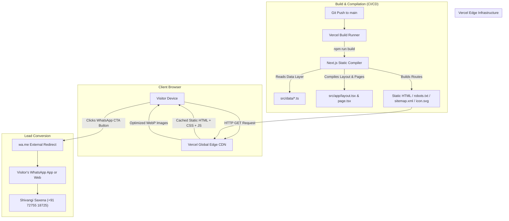
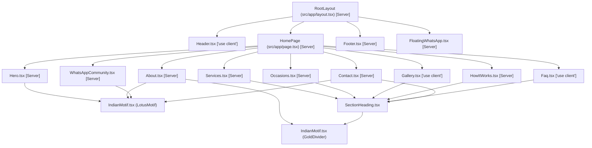

# Shakti Studio — Comprehensive Technical Documentation

> **Version**: 1.0.0  
> **Last Updated**: September 2026  
> **Project Name**: Shakti Studio  
> **Production URL**: [https://shakti-studio.vercel.app](https://shakti-studio.vercel.app)  
> **GitHub Repository**: [https://github.com/ASHWANISAXENAAs/Shakti-Studio](https://github.com/ASHWANISAXENAAs/Shakti-Studio)  
> **Document Purpose**: Complete architectural, operational, and maintenance reference for developers, AI coding agents, and stakeholders.

---

## Table of Contents

1. [Section 1 — Project Overview](#section-1--project-overview)
2. [Section 2 — Technology Stack](#section-2--technology-stack)
3. [Section 3 — Dependencies](#section-3--dependencies)
4. [Section 4 — Project Architecture](#section-4--project-architecture)
5. [Section 5 — Complete Folder Structure](#section-5--complete-folder-structure)
6. [Section 6 — File-by-File Code Structure](#section-6--file-by-file-code-structure)
7. [Section 7 — Component Architecture](#section-7--component-architecture)
8. [Section 8 — Data Architecture](#section-8--data-architecture)
9. [Section 9 — Styling System](#section-9--styling-system)
10. [Section 10 — Image Architecture](#section-10--image-architecture)
11. [Section 11 — WhatsApp Integration](#section-11--whatsapp-integration)
12. [Section 12 — SEO Architecture](#section-12--seo-architecture)
13. [Section 13 — Social Sharing / Open Graph](#section-13--social-sharing--open-graph)
14. [Section 14 — Environment Variables](#section-14--environment-variables)
15. [Section 15 — Local Development](#section-15--local-development)
16. [Section 16 — Build Process](#section-16--build-process)
17. [Section 17 — Git & GitHub Workflow](#section-17--git--github-workflow)
18. [Section 18 — Vercel Deployment](#section-18--vercel-deployment)
19. [Section 19 — How to Make Common Changes](#section-19--how-to-make-common-changes)
20. [Section 20 — Current Business Configuration](#section-20--current-business-configuration)
21. [Section 21 — Security & Privacy](#section-21--security--privacy)
22. [Section 22 — Performance](#section-22--performance)
23. [Section 23 — Accessibility](#section-23--accessibility)
24. [Section 24 — Limitations](#section-24--limitations)
25. [Section 25 — Future Extension Options](#section-25--future-extension-options)
26. [Section 26 — Troubleshooting](#section-26--troubleshooting)
27. [Section 27 — Developer Handover Checklist](#section-27--developer-handover-checklist)
28. [Section 28 — Quick Reference](#section-28--quick-reference)
29. [Section 29 — Technical Summary for Non-Developers](#section-29--technical-summary-for-non-developers)

---

## Section 1 — Project Overview

### 1.1 What is Shakti Studio?
**Shakti Studio** is a boutique creative studio founded and curated by **Shivangi Saxena** in Gola Gokaran Nath (Lakhimpur Kheri district, Uttar Pradesh, India). The studio specializes in custom handcrafted lifestyle, festive, and celebration services:
1. **Customized Ghungroo Sarees**: Tailored sarees embellished with delicate traditional ghungroo borders, custom trims, and drape styling.
2. **Mitti Ki Murti / Handmade Clay Art**: Hand-sculpted festive clay idols, decorative figurines, and keepsake crafts.
3. **Custom Sketch Art**: Hand-drawn graphite and pencil portraits created from customer photographs.
4. **Mehndi Booking**: Traditional bridal, festive (Karwa Chauth, Teej), and celebratory henna application.
5. **Makeup Services**: Elegant, occasion-ready beauty styling for parties, engagements, and weddings.

### 1.2 Purpose of the Website
The website serves as a high-conversion, mobile-first digital brochure and portfolio showcase designed to:
- Establish a trustworthy, professional online presence for the local business.
- Showcase artisanal service offerings and creative style inspirations.
- Explain the simple 5-step commissioning and booking process.
- Funnel all potential customer enquiries directly into a 1-on-1 WhatsApp conversation with Shivangi Saxena.
- Invite loyal clients and community members into the official Shakti Studio WhatsApp Community.

### 1.3 Business Model Supported
The website supports an **inquiry-driven direct boutique craft model**:
- **No Direct E-Commerce Transactions**: Because every creation is custom-made, prices are not displayed on the website. Pricing depends on fabric, intricacy, materials, timeline, and customer requirements.
- **Direct-to-Artist Funnel**: Every call-to-action (CTA) button connects the visitor to WhatsApp with pre-filled context parameters.
- **Zero Overhead**: No transaction fees, no complex payment gateways, and no middleman software.

### 1.4 Main User Journey
```
1. Visitor arrives on https://shakti-studio.vercel.app
   ↓
2. Hero Section: Learns brand identity, tagline, and core offerings
   ↓
3. Services / Occasions / Gallery: Explores bespoke creations & style references
   ↓
4. How It Works: Learns how easy it is to order or book (5 simple steps)
   ↓
5. About Section: Discovers Shivangi Saxena's authentic artistic vision
   ↓
6. Primary Conversion: Clicks "Enquire on WhatsApp", "WhatsApp Us", or Floating CTA
   ↓
7. External Interaction: WhatsApp opens on visitor's phone/desktop with a tailored pre-filled message
   ↓
8. 1-on-1 Consultation: Customer discusses timeline, sends photos, agrees on pricing, and confirms order
```

### 1.5 Architecture Philosophy & Rendering Strategy
- **Rendering Model**: **100% Static Site Generation (SSG)** using Next.js App Router (`output: export`-compatible pre-rendering).
- **Client Interactivity**: Light, isolated client-side "Islands of Interactivity" (`"use client"`) strictly limited to:
  - Mobile drawer navigation & scroll listener (`Header.tsx`)
  - Category filter tabs (`Gallery.tsx`)
  - Interactive accordion toggles (`Faq.tsx`)
- **Server Execution**: All page markup, schemas, and SEO routes (`/`, `/robots.txt`, `/sitemap.xml`, `/icon.svg`, `/_not-found`) are generated statically at build time (`○ Static`).
- **CDN Edge Delivery**: Hosted globally on Vercel's Edge Network with near-instant Time to First Byte (TTFB).

### 1.6 Intentionally Absent Systems
The following systems are **intentionally omitted** by architectural requirement:
- ❌ **No Authentication or User Accounts**: Visitors never need to log in.
- ❌ **No Database or ORM**: No Prisma, MongoDB, PostgreSQL, Supabase, or Firebase. All content lives in version-controlled TypeScript data files.
- ❌ **No Admin Panel / CMS**: No dashboard or WordPress layer. Content is updated via Git.
- ❌ **No Shopping Cart or Checkout**: No cart state, session storage, or checkout flows.
- ❌ **No Payment Gateway**: No Razorpay, Stripe, Paytm, or PayPal scripts.
- ❌ **No Displayed Prices**: Custom quotes are handled dynamically in personal consultations.

---

## Section 2 — Technology Stack

The following table lists only **strictly verified technologies** present in the codebase (`package.json` and `package-lock.json`):

| Technology | Declared Version | Resolved Version | Category | Purpose | Where Used |
| :--- | :--- | :--- | :--- | :--- | :--- |
| **Next.js** | `^15.2.1` | `15.5.25` | Frontend Framework | App Router, static page compilation, image optimization, SEO metadata | Entire application (`src/app/`, `next.config.mjs`) |
| **React** | `^19.0.0` | `19.3.0` | UI Library | Component-based user interface rendering | All components |
| **React DOM** | `^19.0.0` | `19.3.0` | DOM Renderer | Browser DOM rendering for React 19 | Application root |
| **TypeScript** | `^5.8.2` | `5.9.3` | Language | Type safety, interface definitions, and static type checking | Entire codebase (`*.ts`, `*.tsx`, `tsconfig.json`) |
| **Tailwind CSS** | `^3.4.17` | `3.4.19` | CSS Framework | Utility-first styling system, responsive design, custom Indian boutique theme | `tailwind.config.ts`, `src/app/globals.css`, all components |
| **PostCSS** | `^8.5.3` | `8.5.28` | CSS Tooling | CSS parsing, transforming, and Tailwind plugin integration | `postcss.config.mjs` |
| **Autoprefixer** | `^10.4.20` | `10.6.1` | CSS Tooling | Automatically appends vendor prefixes to CSS rules | `postcss.config.mjs` |
| **Lucide React** | `^1.16.0` | `1.47.0` | Icon Library | Clean, accessible SVG iconography | Header, Hero, Services, Occasions, Gallery, Contact, Footer |
| **Next/Image** | Built-in | `15.5.25` | Asset Optimization | Responsive images, WebP conversion, automatic lazy loading, layout shift prevention | `Hero.tsx`, `Services.tsx`, `Gallery.tsx` |
| **Next/Font** | Built-in | `15.5.25` | Typography | Zero-layout-shift Google Fonts loading (`Playfair Display`, `Plus Jakarta Sans`) | `src/app/layout.tsx` |
| **Next Metadata API** | Built-in | `15.5.25` | SEO / Social | Generates `<title>`, `<meta>`, OpenGraph, Twitter cards, JSON-LD, robots, and sitemaps | `layout.tsx`, `robots.ts`, `sitemap.ts` |
| **Node.js** | `>=18.17.0` | `22.17.1` (tested) | Runtime Environment | JavaScript execution engine for local development and build pipelines | Build server, local CLI |
| **npm** | Any (v9+) | `10.8.2` | Package Manager | Package installation and script execution | `package.json`, `package-lock.json` |
| **Git / GitHub** | Any | Remote: GitHub | Version Control | Source code tracking and automated CI/CD deployment triggers | Repository root, GitHub remote |
| **Vercel** | Platform | Serverless Edge | Hosting & Deployment | Global CDN distribution, SSL termination, preview deployments | `shakti-studio.vercel.app` |

---

## Section 3 — Dependencies

### 3.1 Production Dependencies (`dependencies`)
```json
"dependencies": {
  "lucide-react": "^1.16.0",
  "next": "^15.2.1",
  "react": "^19.0.0",
  "react-dom": "^19.0.0"
}
```

- **`next`** (`^15.2.1`, resolved `15.5.25`): Core application framework. Provides App Router, static generation, `next/image`, `next/font`, and static metadata routes (`robots.ts`, `sitemap.ts`).
- **`react`** (`^19.0.0`, resolved `19.3.0`): The foundational library for building component trees.
- **`react-dom`** (`^19.0.0`, resolved `19.3.0`): The glue between React and the browser DOM.
- **`lucide-react`** (`^1.16.0`, resolved `1.47.0`): Icon toolkit providing standard SVG icons (`MessageCircle`, `Sparkles`, `Phone`, `MapPin`, `Users`, `CheckCircle2`, `Menu`, `X`, etc.).

### 3.2 Development Dependencies (`devDependencies`)
```json
"devDependencies": {
  "@types/node": "^22.13.9",
  "@types/react": "^19.0.10",
  "@types/react-dom": "^19.0.4",
  "autoprefixer": "^10.4.20",
  "postcss": "^8.5.3",
  "tailwindcss": "^3.4.17",
  "typescript": "^5.8.2"
}
```

- **`typescript`** (`^5.8.2`, resolved `5.9.3`): Enables strict static typing across `.ts` and `.tsx` files.
- **`@types/node`** (`^22.13.9`, resolved `22.20.4`): TypeScript definitions for Node.js APIs (`process.env`, `path`, etc.).
- **`@types/react`** (`^19.0.10`, resolved `19.3.0`): TypeScript definitions for React elements, hooks, and events.
- **`@types/react-dom`** (`^19.0.4`, resolved `19.3.0`): TypeScript definitions for ReactDOM.
- **`tailwindcss`** (`^3.4.17`, resolved `3.4.19`): Tailwind CSS compiler. Scans class names across source files to generate minimal CSS.
- **`postcss`** (`^8.5.3`, resolved `8.5.28`): CSS processing engine used by Tailwind.
- **`autoprefixer`** (`^10.4.20`, resolved `10.6.1`): PostCSS plugin ensuring cross-browser CSS prefix support.

### 3.3 Dependency Audit Note
- **ESLint**: `"lint": "next lint"` is defined in `package.json` scripts. Next.js invokes its internal lint runner during `next build`.
- **Zero Unused Packages**: All four production dependencies and all seven development dependencies are directly referenced and required for compilation.

---

## Section 4 — Project Architecture

### 4.1 High-Level Architectural Flow
The application has no dynamic backend database, server-side render daemon, or API gateway. It operates as a high-performance **Jamstack application**:



### 4.2 Is there any Backend, Database, or API Layer?
- **Server Actions**: None.
- **API Routes**: None (`src/app/api/` does not exist).
- **Database / ORM**: None. No connection strings, no SQL, no document store.
- **External Hand-off**: The boundary of the website ends when the visitor clicks a WhatsApp button or community link; the lead conversation occurs entirely inside the external WhatsApp application.

---

## Section 5 — Complete Folder Structure

```
Shakti-Studio/
├── public/                               # Static assets served from root URL (/)
│   └── images/                           # Web-optimized imagery
│       ├── shakti-ghungroo-saree-detail.webp # 484x935 px close-up of ghungroo border & craft
│       └── shakti-ghungroo-saree-hero.webp   # 518x935 px cropped showcase portrait
├── src/                                  # Application source directory
│   ├── app/                              # Next.js App Router (pages & metadata)
│   │   ├── globals.css                   # Global styles, Tailwind directives, accessibility
│   │   ├── icon.svg                      # Dynamic vector favicon / app icon
│   │   ├── layout.tsx                    # Root layout, Google fonts, metadata, JSON-LD
│   │   ├── page.tsx                      # Main single-page application orchestrator
│   │   ├── robots.ts                     # Dynamic robots.txt route
│   │   └── sitemap.ts                    # Dynamic sitemap.xml route
│   ├── components/                       # React UI components
│   │   ├── About.tsx                     # Studio story, founder details, monogram emblem
│   │   ├── Contact.tsx                   # Contact details, address, hours, WhatsApp triggers
│   │   ├── Faq.tsx                       # Interactive accordion FAQ ("use client")
│   │   ├── FloatingWhatsApp.tsx          # Persistent bottom-right WhatsApp quick-access CTA
│   │   ├── Footer.tsx                    # Footer navigation, address, dynamic copyright
│   │   ├── Gallery.tsx                   # Style inspiration gallery with category filter ("use client")
│   │   ├── Header.tsx                    # Sticky navbar with mobile drawer & scroll state ("use client")
│   │   ├── Hero.tsx                      # Above-the-fold hero showcase, CTAs, trust badges
│   │   ├── HowItWorks.tsx                # 5-step commissioning and booking guide
│   │   ├── Occasions.tsx                 # 10 milestone celebration cards & custom theme banner
│   │   ├── Services.tsx                  # 5 core service cards with WhatsApp inquiry buttons
│   │   ├── WhatsAppCommunity.tsx         # Community invitation section ("Stay Close to Shakti Studio")
│   │   └── ui/                           # Granular presentational sub-components
│   │       ├── IndianMotif.tsx           # Inline SVG Lotus, Paisley, and GoldDivider motifs
│   │       └── SectionHeading.tsx        # Standardized badge, title, divider & subtitle block
│   └── data/                             # Centralized static configuration & content
│       ├── constants.ts                  # Brand info, founder, address, phone, WhatsApp helper
│       ├── faqs.ts                       # Frequently Asked Questions data
│       ├── gallery.ts                    # Gallery images, categories, and captions
│       ├── occasions.ts                  # Special occasion cards and icons
│       ├── services.ts                   # 5 service definitions, features, and WhatsApp messages
│       └── steps.ts                      # 5-step booking process definitions
├── .gitignore                            # Git exclude patterns
├── next-env.d.ts                         # Next.js TypeScript declarations
├── next.config.mjs                       # Next.js build and image remote patterns configuration
├── package-lock.json                     # Locked dependency tree
├── package.json                          # Scripts and dependency specifications
├── postcss.config.mjs                    # PostCSS plugin pipeline (Tailwind, Autoprefixer)
├── README.md                             # High-level overview and developer notes
├── tailwind.config.ts                    # Tailwind theme extension (colors, fonts, shadows)
└── tsconfig.json                         # TypeScript compiler options and alias paths
```

### Directory Responsibilities
- **`public/`**: Assets stored here are copied directly into the web server root. `/images/shakti-ghungroo-saree-hero.webp` is accessible at `https://shakti-studio.vercel.app/images/shakti-ghungroo-saree-hero.webp`.
- **`src/app/`**: Next.js App Router root. Handles page composition, global CSS imports, HTML headers, metadata, and automated SEO routes (`sitemap.xml`, `robots.txt`).
- **`src/components/`**: Modular presentation components representing logical sections of the landing page.
- **`src/components/ui/`**: Low-level, purely presentational atoms (motifs, section headers) reused across sections.
- **`src/data/`**: The "single source of truth" for all business information, phone numbers, addresses, and content cards.

---

## Section 6 — File-by-File Code Structure

### 6.1 `src/app/layout.tsx`
- **Role**: Root application layout wrapping all pages.
- **Font Integration**: Uses `next/font/google` to load:
  - `Playfair_Display`: Configured with CSS variable `--font-playfair`, subset `latin`, display `swap`.
  - `Plus_Jakarta_Sans`: Configured with CSS variable `--font-sans`, subset `latin`, display `swap`.
- **Viewport Config**: Sets `themeColor: "#5D0E1C"`, `initialScale: 1`, `maximumScale: 5`, and responsive width.
- **Metadata Object**: Complete SEO definition including `title`, `description`, `keywords`, `authors`, `creator`, `publisher`, `robots`, `openGraph`, and `twitter`.
- **JSON-LD Schema**: Embeds Schema.org `LocalBusiness` structured data including name, description, telephone (`+917275518725`), founder (`Shivangi Saxena`), address, and slogan.
- **DOM Structure**: Renders `<Header />`, `<main>{children}</main>`, `<Footer />`, and `<FloatingWhatsApp />`.

### 6.2 `src/app/page.tsx`
- **Role**: Home page orchestrator.
- **Composition**: Assembles the landing page by rendering the section components in logical sequence:
  1. `<Hero />`
  2. `<Services />`
  3. `<Occasions />`
  4. `<Gallery />`
  5. `<HowItWorks />`
  6. `<About />`
  7. `<WhatsAppCommunity />`
  8. `<Faq />`
  9. `<Contact />`

### 6.3 `src/app/globals.css`
- **Role**: Global stylesheet.
- **Tailwind Directives**: `@tailwind base;`, `@tailwind components;`, `@tailwind utilities;`.
- **Base Layer Enhancements**:
  - Smooth scrolling (`scroll-behavior: smooth`).
  - Mobile tap highlight disable (`-webkit-tap-highlight-color: transparent`).
  - Global text selection styling (`selection:bg-maroon-700 selection:text-cream-50`).
  - Accessible focus indicator (`:focus-visible` with `ring-2 ring-maroon-600 ring-offset-2`).
- **Custom Utilities**: `.no-scrollbar` utility for horizontal scroll containers without visible bars.
- **Accessibility**: `@media (prefers-reduced-motion: reduce)` block that forces animation and transition durations to `0.01ms` for users with motion sensitivity.

### 6.4 `src/app/robots.ts`
- **Role**: Dynamic `robots.txt` generator using Next.js MetadataRoute.
- **Logic**: Inspects `NEXT_PUBLIC_SITE_URL`, `VERCEL_PROJECT_PRODUCTION_URL`, and `VERCEL_URL` to determine the sitemap URL. Allows all user-agents (`userAgent: "*"`, `allow: "/"`).

### 6.5 `src/app/sitemap.ts`
- **Role**: Dynamic `sitemap.xml` generator using Next.js MetadataRoute.
- **Logic**: Outputs the primary canonical URL with `lastModified: new Date()`, `changeFrequency: "weekly"`, and `priority: 1.0`.

### 6.6 `src/app/icon.svg`
- **Role**: Vector favicon and browser tab icon.
- **Design**: 32×32 SVG with a deep maroon rounded background (`#5D0E1C`), a thin champagne gold inner ring (`#D4B265`), and a bold serif letter `"S"` in warm ivory (`#FDFBF5`).

### 6.7 `src/components/Header.tsx`
- **Role**: Sticky top navigation bar.
- **Client Features (`"use client"`)**:
  - `scrolled` state: Detects scroll position > 20px via `window.addEventListener("scroll")` to apply a frosted glass background (`backdrop-blur-md bg-cream-50/95 shadow-soft`).
  - `mobileMenuOpen` state: Controls mobile sliding drawer menu with hamburger / close (`Menu` / `X`) toggle.
  - Scroll lock: Disables `document.body.style.overflow` when mobile drawer is open.
- **Navigation Links**: 7 anchor targets (`#hero`, `#services`, `#occasions`, `#gallery`, `#how-it-works`, `#about`, `#contact`).
- **Direct CTA**: Header button linking to WhatsApp with prefilled message.

### 6.8 `src/components/Hero.tsx`
- **Role**: High-impact above-the-fold brand introduction.
- **Visual Showcase**: Framed image container featuring `/images/shakti-ghungroo-saree-hero.webp` with `object-cover object-top`, subtle maroon gradient overlay, and floating "Boutique Creation" tag.
- **Value Props**: Includes 3 trust badges: "Custom Made", "Handcrafted", "Direct Chat".
- **CTAs**: Primary button scrolling to `#services`, secondary button opening WhatsApp.

### 6.9 `src/components/Services.tsx`
- **Role**: Showcase of the 5 primary studio services.
- **Structure**: Iterates over `SERVICES` array. The first card ("Customized Ghungroo Sarees") features `/images/shakti-ghungroo-saree-detail.webp`, while the others use curated Unsplash references.
- **Information Architecture**: Each card displays a category tag, title, description, bulleted feature list or "Available For" pills, pricing transparency disclaimer, and an "Enquire on WhatsApp" action button.

### 6.10 `src/components/Occasions.tsx`
- **Role**: Celebratory occasion inspiration section.
- **Structure**: Maps 10 occasions (`SPECIAL_OCCASIONS`) with dedicated icons (`Sparkles`, `HeartHandshake`, `Moon`, `Sun`, `Flame`, etc.) and subtitles.
- **Bottom Callout**: Deep maroon banner inviting visitors with custom themes to discuss color palettes and dates on WhatsApp.

### 6.11 `src/components/Gallery.tsx`
- **Role**: Interactive style inspiration gallery.
- **Client Features (`"use client"`)**:
  - Category filter tabs (`All`, `Saree`, `Mehndi`, `Makeup`, `Sketches`, `Handmade Art`).
  - Active tab highlighting and client-side array filtering.
- **Transparency Notice**: Clear disclaimer stating that representative style references are shown while real portfolio photography is being compiled.

### 6.12 `src/components/HowItWorks.tsx`
- **Role**: Process clarity section removing booking friction.
- **Structure**: 5 distinct steps rendered in a clean grid showing step numbers, descriptions, and a final "Start Your Order on WhatsApp" CTA.

### 6.13 `src/components/About.tsx`
- **Role**: Founder profile and artistic story.
- **Emblem Presentation**: Features a bespoke royal maroon and gold "SS" monogram emblem card representing Shivangi Saxena (deliberately avoiding stock photos of random women).
- **Narrative**: Genuine artist statement detailing her background, passion for Indian crafts, and personal care given to every client.

### 6.14 `src/components/WhatsAppCommunity.tsx`
- **Role**: VIP community invitation.
- **Headline**: "Stay Close to Shakti Studio".
- **Copy**: Highlights festive first-looks, booking slot alerts, and a direct creative circle.
- **Action**: Links directly to the official Shakti Studio WhatsApp group invite link.

### 6.15 `src/components/Faq.tsx`
- **Role**: Interactive Frequently Asked Questions accordion.
- **Client Features (`"use client"`)**: Single-item accordion state (`openIndex`). First item is expanded by default. Accessible ARIA attributes (`aria-expanded`, `aria-controls`).

### 6.16 `src/components/Contact.tsx`
- **Role**: Direct contact hub.
- **Content**: Displays WhatsApp card with phone number (`+91 72755 18725`), studio location card (`Unchi Bhood, Gola Gokaran Nath`), operating hours (`Monday – Sunday: 10:00 AM – 7:00 PM IST`), and WhatsApp community card.

### 6.17 `src/components/FloatingWhatsApp.tsx`
- **Role**: Persistent quick-access floating action button (FAB).
- **Positioning**: Fixed at `bottom-5 right-5 sm:bottom-6 sm:right-6 z-40`.
- **Visual Details**: Official WhatsApp green (`#25D366`), white icon with subtle ping notification pulse, and accessible label.

### 6.18 `src/components/Footer.tsx`
- **Role**: Page footer.
- **Content**: Studio branding, tagline, founder credit, full physical address, quick navigation links, service links, and dynamic copyright year calculation (`new Date().getFullYear()`).

### 6.19 `src/components/ui/IndianMotif.tsx`
- **Role**: SVG motif library.
- **Exports**:
  - `LotusMotif`: Stylized Indian lotus bloom SVG.
  - `PaisleyMotif`: Traditional mango / paisley motif SVG.
  - `GoldDivider`: Ornamental divider line with diamond and bead accents.

### 6.20 `src/components/ui/SectionHeading.tsx`
- **Role**: Reusable section header component.
- **Props**: `badge`, `title`, `subtitle`, `centered`, `className`. Renders badge pill, serif headline, and ornamental `GoldDivider`.

---

## Section 7 — Component Architecture

### 7.1 Component Hierarchy Diagram


### 7.2 Server vs. Client Component Breakdown

| Component | Type | Directive | Reason for Strategy |
| :--- | :--- | :--- | :--- |
| `layout.tsx` | Server | *None* | Root layout, metadata injection, and JSON-LD schema generation. |
| `page.tsx` | Server | *None* | Static page container; requires zero client state. |
| `Header.tsx` | Client | `"use client"` | Manages mobile drawer toggle (`useState`), scroll listener (`useEffect`), and body scroll lock. |
| `Hero.tsx` | Server | *None* | Purely presentational markup and optimized `next/image`. |
| `Services.tsx` | Server | *None* | Reads static service data and renders static card grid. |
| `Occasions.tsx` | Server | *None* | Reads static occasion data and renders icon grid. |
| `Gallery.tsx` | Client | `"use client"` | Manages active category filter tab state (`useState`). |
| `HowItWorks.tsx` | Server | *None* | Static process list. |
| `About.tsx` | Server | *None* | Static founder profile and SVG monogram emblem. |
| `WhatsAppCommunity.tsx` | Server | *None* | Static community CTA section. |
| `Faq.tsx` | Client | `"use client"` | Manages accordion item open/close toggle state (`useState`). |
| `Contact.tsx` | Server | *None* | Static contact cards and address details. |
| `FloatingWhatsApp.tsx` | Server | *None* | Fixed anchor element with constant URL; no client state required. |
| `Footer.tsx` | Server | *None* | Static navigation links and dynamic current year calculation. |
| `IndianMotif.tsx` | Server | *None* | Pure SVG rendering functions. |
| `SectionHeading.tsx` | Server | *None* | Pure presentational component. |

---

## Section 8 — Data Architecture

### 8.1 Centralized vs. Hard-Coded Strategy
All core business parameters, phone numbers, addresses, WhatsApp pre-filled text strings, and structured catalogue items are isolated within `src/data/`. Components never hard-code phone numbers or WhatsApp links; they always import from data files or call `getWhatsAppUrl()`.

### 8.2 Data Files Reference Table

| Data File | Primary Interface / Export | Content Summary | Consumed By |
| :--- | :--- | :--- | :--- |
| **`src/data/constants.ts`** | `SITE_CONFIG`<br>`getWhatsAppUrl(message)` | Brand name, tagline, founder, role, phone, address, community link, WhatsApp link generator | `layout.tsx`, `Header.tsx`, `Hero.tsx`, `About.tsx`, `WhatsAppCommunity.tsx`, `Contact.tsx`, `Footer.tsx`, `FloatingWhatsApp.tsx` |
| **`src/data/services.ts`** | `ServiceItem`<br>`SERVICES` | 5 services: ID, title, short description, full description, features/inclusions, prefilled message, image, alt text, badge tag | `Services.tsx` |
| **`src/data/occasions.ts`** | `OccasionItem`<br>`SPECIAL_OCCASIONS` | 10 occasion items: name, subtitle, Lucide icon name, optional badge | `Occasions.tsx` |
| **`src/data/gallery.ts`** | `GalleryItem`<br>`GALLERY_ITEMS` | 10 inspiration items: ID, title, category, image URL, aspect ratio, caption | `Gallery.tsx` |
| **`src/data/steps.ts`** | `ProcessStep`<br>`HOW_IT_WORKS_STEPS` | 5 booking steps: step label, number, title, description | `HowItWorks.tsx` |
| **`src/data/faqs.ts`** | `FaqItem`<br>`FAQS` | 7 FAQ items: question, answer | `Faq.tsx` |

### 8.3 Safe Content Extension Guide
- **To Add a New Service**: Append an object to the `SERVICES` array in `src/data/services.ts`. No changes to `Services.tsx` layout code are required; the grid updates automatically.
- **To Add a New FAQ**: Append an object `{ question: "...", answer: "..." }` to `FAQS` in `src/data/faqs.ts`.
- **To Add a New Gallery Item**: Append an object to `GALLERY_ITEMS` in `src/data/gallery.ts`. Ensure the `category` matches one of the allowed union types (`"Saree" | "Mehndi" | "Makeup" | "Sketches" | "Handmade Art"`).
- **To Add a Special Occasion**: Append an object to `SPECIAL_OCCASIONS` in `src/data/occasions.ts`. If using a new icon, register it in `ICON_MAP` inside `Occasions.tsx`.

---

## Section 9 — Styling System

### 9.1 Tailwind CSS Configuration (`tailwind.config.ts`)
The project utilizes **Tailwind CSS v3.4** configured with custom extensions reflecting a luxury Indian boutique visual identity:

```typescript
// tailwind.config.ts color palette summary
colors: {
  cream: {
    50: "#FDFCF9",  // Primary page background
    100: "#F9F6F0", // Card and section alternates
    200: "#F1EAE0", // Light border accent
    300: "#E6DBCB",
    400: "#D7C5AF",
  },
  maroon: {
    50: "#FAF0F2",  // Pill and badge background
    100: "#F4DCE1",
    500: "#A8263B",
    600: "#8E1E31",
    700: "#751525",
    800: "#5D0E1C", // Brand primary luxury maroon
    900: "#440813",
    950: "#2B030A", // Deep contrast dark background
  },
  gold: {
    50: "#FDFBF5",
    100: "#FAF4E4",
    200: "#F2E4BF",
    300: "#E6CE93",
    400: "#D4B265", // Primary metallic gold accent
    500: "#BD9338",
    600: "#9E7623",
    700: "#7A5817",
  },
  terracotta: {
    50: "#FAF3F1",
    100: "#F3E2DE",
    500: "#BA5B45", // Earthy clay craft accent
    600: "#A04732",
    700: "#823523",
  },
  charcoal: {
    700: "#4A4042", // High-contrast readable body text
    800: "#2F2728",
    900: "#1E1718", // Dark primary text
  },
}
```

### 9.2 Typography System
Configured via `fontFamily` in `tailwind.config.ts` mapping to Next.js CSS variables:
- **Serif (`font-serif`)**: `["var(--font-playfair)", "Georgia", "serif"]`
  - Used for headlines (`h1`, `h2`, `h3`), section titles, and brand logo.
- **Sans-serif (`font-sans`)**: `["var(--font-sans)", "system-ui", "sans-serif"]`
  - Used for body paragraphs, button labels, badges, and technical elements.

### 9.3 Custom Box Shadows
- **`shadow-soft`**: `0 4px 20px -2px rgba(93, 14, 28, 0.05)` (Subtle maroon-tinted elevation)
- **`shadow-elevated`**: `0 10px 30px -4px rgba(93, 14, 28, 0.08), 0 4px 6px -2px rgba(93, 14, 28, 0.04)`
- **`shadow-gold-glow`**: `0 0 25px rgba(212, 178, 101, 0.25)` (Used on the emblem and community CTA)

### 9.4 Responsive Breakpoint System
- **Mobile (<640px)**: 1-column layouts, sticky header with mobile drawer, full-width buttons, horizontal scrolling gallery tabs.
- **Tablet (640px – 1024px)**: 2-column cards, 3-column occasion grid, adjusted paddings (`sm:py-24`).
- **Desktop (>=1024px)**: 12-column grid system in Hero/About (`lg:col-span-7` + `lg:col-span-5`), 3-column service cards, 5-column occasion grid.

---

## Section 10 — Image Architecture

### 10.1 Image Storage & Distribution Strategy
1. **Local High-Fidelity Assets (`public/images/`)**:
   - `shakti-ghungroo-saree-hero.webp` (518×935 px, 104.7 KB): Cropped from the left portion of the studio's approved ghungroo saree photography. Shows the model, ivory saree, embroidered maroon border, and ghungroo bells. Styled with `object-cover object-top` to frame the face and craftsmanship without clipping.
   - `shakti-ghungroo-saree-detail.webp` (484×935 px, 88.5 KB): Cropped from the right portion of the approved photography. Focuses entirely on the maroon zardozi embroidery, seed pearls, gold ghungroo bells, and sheer fabric texture.
2. **Remote Reference Imagery (Unsplash CDN)**:
   - Configured in `next.config.mjs` under `images.remotePatterns` for `images.unsplash.com` and `plus.unsplash.com`.
   - Used for the remaining services (Clay Art, Sketches, Mehndi, Makeup) and the Gallery section as **style inspiration references**.

### 10.2 Transparency & Authenticity Rules
- **Representative Imagery**: All remote gallery photos and service images are clearly marked as style references.
- **Founder Authenticity**: No stock photo of any woman is presented as Shivangi Saxena. The About section features an elegant monogram emblem card until an authentic portrait photograph of Shivangi is provided.

### 10.3 Next/Image Optimization
All images utilize the `<Image />` component from `next/image`:
- `fill`: Enables responsive scaling within parent container without layout shifts.
- `priority`: Applied to the Hero image to trigger preload during initial page render.
- `sizes`: Responsive sizes hints (e.g., `sizes="(max-width: 768px) 100vw, (max-width: 1200px) 50vw, 450px"`) ensure the browser downloads the smallest suitable image variant.

---

## Section 11 — WhatsApp Integration

### 11.1 Central Configuration
Located in `src/data/constants.ts`:
- **Phone Number**: `+91 72755 18725` (Formatted for display: `"+91 72755 18725"`, dialer string: `"917275518725"`).
- **Community URL**: `https://chat.whatsapp.com/JSUAWsf8WRPCfYBqXxrPqh`.
- **Default Message**: `"Hi Shivangi, I found Shakti Studio online and would like to know more about your services."`.

### 11.2 Link Generation Helper
```typescript
export function getWhatsAppUrl(message?: string): string {
  const text = message || SITE_CONFIG.defaultWhatsAppMessage;
  return `https://wa.me/${SITE_CONFIG.whatsappNumber}?text=${encodeURIComponent(text)}`;
}
```

### 11.3 WhatsApp CTA Locations & Prefilled Messages

| Location | Component | Prefilled Message Text |
| :--- | :--- | :--- |
| **Floating Action Button** | `FloatingWhatsApp.tsx` | *"Hi Shivangi, I found Shakti Studio online and would like to know more about your services."* |
| **Header Action Button** | `Header.tsx` | *"Hi Shivangi, I would like to enquire about Shakti Studio services."* |
| **Hero WhatsApp CTA** | `Hero.tsx` | *"Hi Shivangi, I am interested in exploring Shakti Studio services."* |
| **Ghungroo Saree Card** | `Services.tsx` | *"Hi Shivangi, I am interested in a Customized Ghungroo Saree. Please share more details."* |
| **Clay Art Card** | `Services.tsx` | *"Hi Shivangi, I would like to enquire about your Mitti Ki Murti / Handmade Clay Art creations. Please share details and availability."* |
| **Sketch Art Card** | `Services.tsx` | *"Hi Shivangi, I am interested in ordering a Custom Sketch Art from a photograph. Please let me know how to proceed."* |
| **Mehndi Booking Card** | `Services.tsx` | *"Hi Shivangi, I would like to enquire about Mehndi Booking for an upcoming occasion. Please share availability and details."* |
| **Makeup Services Card** | `Services.tsx` | *"Hi Shivangi, I would like to enquire about your Makeup Services. Please let me know your availability and details."* |
| **Occasion Banner CTA** | `Occasions.tsx` | *"Hi Shivangi, I would like to discuss styling/art for an upcoming special occasion."* |
| **How It Works CTA** | `HowItWorks.tsx` | *"Hi Shivangi, I am ready to discuss my requirement!"* |
| **Contact Direct Chat** | `Contact.tsx` | *"Hi Shivangi, I would like to get in touch regarding your studio services."* |
| **WhatsApp Community** | `WhatsAppCommunity.tsx` | *Direct join URL to the official community group* |

---

## Section 12 — SEO Architecture

### 12.1 Next.js Metadata Implementation (`src/app/layout.tsx`)
- **Page Title**: `Shakti Studio | Custom Sarees, Mehndi, Makeup & Handmade Art`
- **Description**: Comprehensive 160-character description including brand, core crafts, founder name, and city location (`Gola Gokaran Nath, Uttar Pradesh`).
- **Keywords**: 15 targeted keywords covering localized and service-specific search terms.
- **Robots Directives**: `index: true`, `follow: true`, `googleBot: { "max-image-preview": "large", "max-snippet": -1 }`.

### 12.2 Search Engine Discovery Files
- **`robots.txt` (`src/app/robots.ts`)**: Dynamically served at `/robots.txt`. Emits:
  ```text
  User-Agent: *
  Allow: /
  Sitemap: https://shakti-studio.vercel.app/sitemap.xml
  ```
- **`sitemap.xml` (`src/app/sitemap.ts`)**: Dynamically served at `/sitemap.xml`. Emits the canonical root entry with `changeFrequency: "weekly"`, `priority: 1.0`.

### 12.3 Schema.org JSON-LD Structured Data
Injected into the `<head>` of `layout.tsx` using `<script type="application/ld+json">`:
```json
{
  "@context": "https://schema.org",
  "@type": "LocalBusiness",
  "name": "Shakti Studio",
  "description": "Handcrafted customized ghungroo sarees, mitti ki murti clay art, custom sketch portraits, bridal & festive mehndi, and celebratory makeup styling.",
  "telephone": "+917275518725",
  "founder": {
    "@type": "Person",
    "name": "Shivangi Saxena",
    "jobTitle": "Founder & Creative Artist, Shakti Studio"
  },
  "address": {
    "@type": "PostalAddress",
    "streetAddress": "Unchi Bhood",
    "addressLocality": "Gola Gokaran Nath",
    "addressRegion": "Uttar Pradesh",
    "postalCode": "262802",
    "addressCountry": "IN"
  },
  "slogan": "Handcrafted with Love • Styled for Your Moments"
}
```

---

## Section 13 — Social Sharing / Open Graph

### 13.1 OpenGraph & Twitter Card Configuration
Configured in `src/app/layout.tsx`:
- **`og:title`**: `Shakti Studio | Custom Sarees, Mehndi, Makeup & Handmade Art`
- **`og:description`**: `Handcrafted customized sarees, clay art, portrait sketches, mehndi, and bridal beauty styled for your moments by Shivangi Saxena.`
- **`og:type`**: `website`
- **`og:locale`**: `en_IN`
- **`og:siteName`**: `Shakti Studio`
- **`og:image`**: 1200×630 image configured with width, height, and descriptive alt text.
- **`twitter:card`**: `summary_large_image`

### 13.2 Social Cache Invalidation
- **WhatsApp Link Previews**: WhatsApp caches OpenGraph link previews aggressively on its edge servers. When sharing a link on WhatsApp, if the thumbnail does not refresh immediately, use Facebook's [Sharing Debugger](https://developers.facebook.com/tools/debug/) to force Facebook's scraper to re-crawl the URL.

---

## Section 14 — Environment Variables

| Variable | Required? | Purpose | Default / Local Strategy | Vercel Production Strategy |
| :--- | :--- | :--- | :--- | :--- |
| **`NEXT_PUBLIC_SITE_URL`** | Recommended | Canonical base URL for sitemap and robots. | Defaults to `http://localhost:3000` | Set to `https://shakti-studio.vercel.app` in Vercel Project Settings. |
| **`VERCEL_PROJECT_PRODUCTION_URL`** | Automatic | Production domain assigned by Vercel. | Undefined locally | Automatically populated by Vercel (e.g. `shakti-studio.vercel.app`). |
| **`VERCEL_URL`** | Automatic | Deployment-specific preview domain. | Undefined locally | Automatically populated by Vercel for preview branches. |

*Security Note: No secret keys, database credentials, or private API tokens exist in this repository.*

---

## Section 15 — Local Development

### 15.1 System Prerequisites
- **Operating System**: Windows 10/11, macOS, or Linux
- **Node.js**: `v18.17.0` or later (tested and verified on `v22.17.1`)
- **Package Manager**: `npm` (v9 or v10)

### 15.2 Step-by-Step Local Setup
1. **Clone the Repository**:
   ```bash
   git clone https://github.com/ASHWANISAXENAAs/Shakti-Studio.git
   cd Shakti-Studio
   ```
2. **Install Dependencies**:
   ```bash
   npm install
   ```
3. **Start the Development Server**:
   ```bash
   npm run dev
   ```
4. **Open in Browser**:
   Navigate to `http://localhost:3000`. Hot Module Replacement (HMR) will automatically update the browser as files are edited.
5. **Execute Code Quality Checks**:
   ```bash
   npm run lint
   ```
6. **Verify Production Build Locally**:
   ```bash
   npm run build
   npm run start
   ```

---

## Section 16 — Build Process

### 16.1 Build Pipeline (`npm run build`)
Executing `npm run build` triggers Next.js compiler steps:
1. **Compilation**: Transpiles TypeScript and JSX down to optimized JavaScript bundles.
2. **Type Checking**: Runs `tsc` compiler to guarantee zero type errors.
3. **Lint Verification**: Invokes Next.js linter.
4. **Static Route Pre-rendering**: Builds all HTML pages and metadata routes statically.
5. **Asset Optimization**: Generates optimized chunk sizes and bundles.

### 16.2 Verified Build Output Metrics
```
Route (app)                                 Size  First Load JS
┌ ○ /                                    12.2 kB         115 kB
├ ○ /_not-found                            994 B         104 kB
├ ○ /icon.svg                                0 B            0 B
├ ○ /robots.txt                            127 B         103 kB
└ ○ /sitemap.xml                           127 B         103 kB
+ First Load JS shared by all             103 kB
```
- **Exit Code**: `0` (Clean build, zero warnings or errors).
- **Prerender Type**: All routes marked `○ (Static)`.

---

## Section 17 — Git & GitHub Workflow

### 17.1 Branching Strategy
- **`main`**: The single production branch. Any commit pushed to `origin/main` immediately triggers a live production deployment on Vercel.
- **Repository URL**: `https://github.com/ASHWANISAXENAAs/Shakti-Studio`

### 17.2 Standard Development Cycle
```bash
# 1. Pull latest changes
git pull origin main

# 2. Make your edits and verify locally
npm run dev

# 3. Test production build
npm run build

# 4. Stage and commit
git add .
git commit -m "feat: your concise commit message"

# 5. Push to trigger live deployment
git push origin main
```

### 17.3 Excluded Files (`.gitignore`)
The following files are strictly excluded from version control:
- `/node_modules`
- `/.next/` and `/out/`
- `.vercel`
- `.env` and `.env*.local`
- OS files (`Thumbs.db`, `.DS_Store`)

---

## Section 18 — Vercel Deployment

### 18.1 Continuous Deployment Pipeline
```
Local Git Commit
   ↓
git push origin main
   ↓
GitHub Repository (ASHWANISAXENAAs/Shakti-Studio)
   ↓
Vercel Webhook Event
   ↓
Vercel Cloud Build Runner (npm run build)
   ↓
Static Asset Upload to Vercel Global Edge Network
   ↓
Live Production: https://shakti-studio.vercel.app (Zero-Downtime Atomic Swap)
```

### 18.2 Rollback Capability
In the event an unintended change reaches production:
1. Open the [Vercel Dashboard](https://vercel.com).
2. Select the **Shakti-Studio** project.
3. Navigate to the **Deployments** tab.
4. Locate the previous stable deployment and click **Instant Rollback**.

---

## Section 19 — How to Make Common Changes

| Change Request | File to Edit | Instructions |
| :--- | :--- | :--- |
| **Change WhatsApp Phone Number** | `src/data/constants.ts` | Update `phoneDisplay` (e.g. `"+91 72755 18725"`) and `whatsappNumber` (e.g. `"917275518725"`). All CTAs, JSON-LD, and contact cards will update automatically. |
| **Change Physical Address** | `src/data/constants.ts` | Update the `location` object fields (`street`, `city`, `district`, `state`, `pincode`, `formattedAddress`). |
| **Update Founder Name / Title** | `src/data/constants.ts` | Update `owner` and `ownerRole`. |
| **Update Community Link** | `src/data/constants.ts` | Update `whatsappCommunityUrl`. |
| **Edit / Add a Service** | `src/data/services.ts` | Modify or append an object to `SERVICES`. Set `title`, `description`, `features`, `prefilledMessage`, and `image`. |
| **Replace Hero Saree Image** | `public/images/` & `src/components/Hero.tsx` | Save the new image to `public/images/new-hero.webp`. In `Hero.tsx`, update the `src` attribute of `<Image />`. |
| **Replace Service Card Image** | `src/data/services.ts` | Update the `image` path in the corresponding service item (e.g. `/images/new-detail.webp`). |
| **Add / Edit FAQs** | `src/data/faqs.ts` | Edit or append `{ question: "...", answer: "..." }` in the `FAQS` array. |
| **Update SEO Title or Description** | `src/app/layout.tsx` | Update `metadata.title` and `metadata.description`. |
| **Add Real Founder Photograph** | `src/components/About.tsx` | Replace the monogram emblem container in the left column with `<Image src="/images/shivangi.webp" alt="Shivangi Saxena" fill className="object-cover rounded-2xl" />`. |

---

## Section 20 — Current Business Configuration

- **Brand Name**: Shakti Studio
- **Tagline**: *"Handcrafted with Love • Styled for Your Moments"*
- **Founder**: Shivangi Saxena
- **Role**: Founder & Creative Artist, Shakti Studio
- **Official WhatsApp**: `+91 72755 18725` (`https://wa.me/917275518725`)
- **Official Community**: `https://chat.whatsapp.com/JSUAWsf8WRPCfYBqXxrPqh`
- **Studio Address**: Unchi Bhood, Gola Gokaran Nath, Kheri, Uttar Pradesh – 262802, India
- **Production URL**: [https://shakti-studio.vercel.app](https://shakti-studio.vercel.app)
- **GitHub Repository**: [https://github.com/ASHWANISAXENAAs/Shakti-Studio](https://github.com/ASHWANISAXENAAs/Shakti-Studio)
- **Active Services**:
  1. Customized Ghungroo Sarees
  2. Mitti Ki Murti / Handmade Clay Art
  3. Custom Sketch Art
  4. Mehndi Booking
  5. Makeup Services

---

## Section 21 — Security & Privacy

### 21.1 Current Attack Surface Audit
Because the application is 100% static:
- **Zero Database Exposure**: There are no database credentials or endpoints to breach via SQL injection.
- **No User Data at Rest**: The website collects and stores zero visitor data, cookies, or tracking IDs.
- **Zero Cross-Site Scripting (XSS)**: No dynamic user input is reflected or rendered into DOM trees.
- **Zero Authentication Exploits**: No password stores, session cookies, or JWT tokens exist.
- **HTTPS Enforced**: SSL certificates are managed, renewed, and enforced automatically by Vercel.

### 21.2 Future Security Considerations
If a contact form, user account portal, or payment processing gateway is introduced in the future:
- Input sanitization and CSRF protection must be implemented.
- Payment handling must adhere to PCI-DSS by using hosted checkout elements (e.g. Stripe Checkout or Razorpay Standard).
- A GDPR / Indian Digital Personal Data Protection (DPDP) Act privacy policy must be published.

---

## Section 22 — Performance

### 22.1 Performance Architecture
- **Static Pre-rendering**: Pages load with zero server execution overhead.
- **Sub-115 kB Initial Bundle**: First Load JS shared by all routes is only ~103 kB, ensuring swift execution on 3G/4G mobile networks in rural/semi-urban regions.
- **Responsive Image Serving**: Next/Image generates responsive `srcset` definitions and converts assets to WebP automatically.
- **Google Fonts Optimization**: `next/font/google` downloads Google fonts at build time and inlines font definitions, eliminating render-blocking external network requests.
- **CSS Purging**: Tailwind CSS extracts and compiles only the utility classes actually used in components.

---

## Section 23 — Accessibility

### 23.1 Implemented Features
- **Semantic HTML**: Proper landmark elements (`<header>`, `<main>`, `<footer>`, `<section>`, `<aside>`, `<nav>`).
- **Accessible Navigation**: Links feature clear descriptive labels; mobile menu includes `aria-expanded` and body scroll lock.
- **Descriptive Alt Text**: Images include contextual descriptions detailing colors, borders, and materials.
- **Keyboard Navigation**: Explicit `:focus-visible` styling (`ring-2 ring-maroon-600 ring-offset-2 ring-offset-cream-50`) ensures all buttons and links are navigable via Tab key.
- **Reduced Motion Support**: Complete `@media (prefers-reduced-motion: reduce)` rule block in `globals.css` ensuring users with vestibular disorders experience zero abrupt animations.

### 23.2 Future Accessibility Opportunities
- Add an explicit "Skip to Main Content" landmark link at the top of `layout.tsx`.
- Conduct screen-reader audits using NVDA or VoiceOver on iOS.

---

## Section 24 — Limitations

The following items are not defects, but **deliberate architectural boundaries** of the current static site:
- **No Self-Service Admin Panel**: Modifying text or services requires committing changes to Git.
- **No Direct Calendar Booking**: Visitors cannot select dates on an interactive calendar; scheduling occurs during the WhatsApp consultation.
- **No Shopping Cart / Checkout**: Transactions cannot be finalized directly on the website.
- **No Analytics Dashboard**: Google Analytics or Vercel Web Analytics is not currently embedded.

---

## Section 25 — Future Extension Options

If the studio decides to expand its digital capabilities, the recommended phased approach is:

- **Phase 1 — Real Portfolio Integration**:
  - Replace Unsplash references with authentic studio photos of completed sarees, clay murtis, sketches, and bridal clients.
  - Replace the monogram emblem in `About.tsx` with an authentic portrait of Shivangi Saxena.
- **Phase 2 — Direct Serverless Contact Form**:
  - Add a lightweight Next.js API Route (`src/app/api/contact/route.ts`) using Resend or Nodemailer to send email notifications directly to Shivangi in addition to WhatsApp.
- **Phase 3 — Headless CMS**:
  - Integrate a headless CMS (e.g. Sanity.io or Strapi) so Shivangi can upload new photos and update service descriptions without editing code.
- **Phase 4 — Online Booking Calendar**:
  - Embed Calendly or integrate a serverless calendar booking tool for Mehndi and Makeup appointments.
- **Phase 5 — Full E-Commerce**:
  - Implement a full shopping cart with Razorpay/Stripe checkout if the studio begins selling ready-to-wear sarees nationwide.

---

## Section 26 — Troubleshooting

### 1. PowerShell Script Execution Policy Error on Windows
- **Issue**: `npm : File ... cannot be loaded because running scripts is disabled on this system.`
- **Fix**: Open PowerShell as Administrator and run:
  ```powershell
  Set-ExecutionPolicy -ExecutionPolicy RemoteSigned -Scope CurrentUser
  ```

### 2. Next.js Build Cache Corruption
- **Issue**: Build fails with unexpected webpack or cache errors.
- **Fix**: Delete `.next` directory and rebuild:
  ```bash
  rm -rf .next
  npm run build
  ```

### 3. Remote Image Fails to Render (`Invalid src prop`)
- **Issue**: An external image URL fails with `hostname is not configured under images in your next.config.js`.
- **Fix**: Open `next.config.mjs` and add the domain under `images.remotePatterns`.

### 4. WhatsApp Sharing Thumbnail Shows Old Image
- **Issue**: Sharing `https://shakti-studio.vercel.app` on WhatsApp displays an outdated preview image.
- **Fix**: Open [Facebook Sharing Debugger](https://developers.facebook.com/tools/debug/), enter the URL, and click **Scrape Again**.

### 5. Git Push Rejected (`non-fast-forward`)
- **Issue**: `git push origin main` is rejected because remote has commits not present locally.
- **Fix**: Run `git pull --rebase origin main` followed by `git push origin main`.

---

## Section 27 — Developer Handover Checklist

When handing this codebase to another engineer or AI assistant:
- [x] Verify Git repository access: `https://github.com/ASHWANISAXENAAs/Shakti-Studio`
- [x] Verify Node.js version is `>=18.17.0` (Node 22 recommended)
- [x] Run `npm install` and verify zero peer dependency conflicts
- [x] Run `npm run build` and ensure exit code `0`
- [x] Verify `src/data/constants.ts` contains accurate contact and address information
- [x] Confirm that Vercel project is linked to GitHub `main` branch
- [x] Ensure that `public/images/` contains all referenced local WebP files
- [x] Confirm no API keys or secrets are committed

---

## Section 28 — Quick Reference

```bash
# -------------------------------------------------------------
# COMMAND CHEAT SHEET
# -------------------------------------------------------------
# Run development server
npm run dev

# Compile production build
npm run build

# Preview production build locally
npm run start

# Run linter
npm run lint

# Standard Git deploy flow
git add .
git commit -m "update: description"
git push origin main
```

- **Live URL**: `https://shakti-studio.vercel.app`
- **GitHub**: `https://github.com/ASHWANISAXENAAs/Shakti-Studio`
- **Primary Configuration**: `src/data/constants.ts`
- **Primary Layout & SEO**: `src/app/layout.tsx`
- **Tailwind Palette**: `tailwind.config.ts`

---

## Section 29 — Technical Summary for Non-Developers

### Plain English Summary for the Business Owner
- **What is this website?**  
  A modern, high-speed mobile-first showcase for Shakti Studio designed to turn visitors into WhatsApp conversations.
- **Where is the website hosted?**  
  The website is hosted on **Vercel**, one of the world's fastest cloud hosting platforms for web applications.
- **Where is the code kept safely?**  
  The entire website codebase is backed up in your official GitHub account under `ASHWANISAXENAAs/Shakti-Studio`.
- **How do updates reach the live site?**  
  Whenever a developer saves changes and pushes them to GitHub, Vercel automatically detects the update, tests the build, and publishes the new version to `https://shakti-studio.vercel.app` within approximately one minute.
- **Is there a database storing customer data?**  
  No. The website does not collect, record, or store passwords, names, or payment cards. It is completely secure by design.
- **How do customer inquiries work?**  
  When a customer clicks any button on the website, WhatsApp immediately opens on their phone with a friendly, pre-written message addressed to Shivangi Saxena. The entire booking discussion and payment agreement happens directly in your personal chat.
- **What should be maintained?**  
  As Shivangi completes real orders and captures high-resolution photographs of her custom sarees, clay art, sketches, and bridal clients, those real photographs can simply replace the temporary style reference images in the gallery and service cards.
